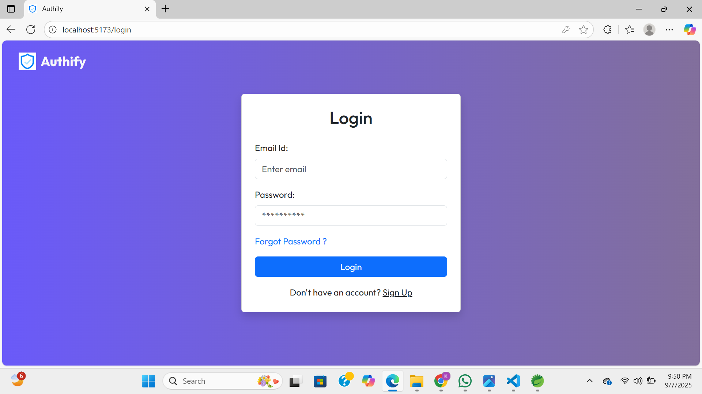
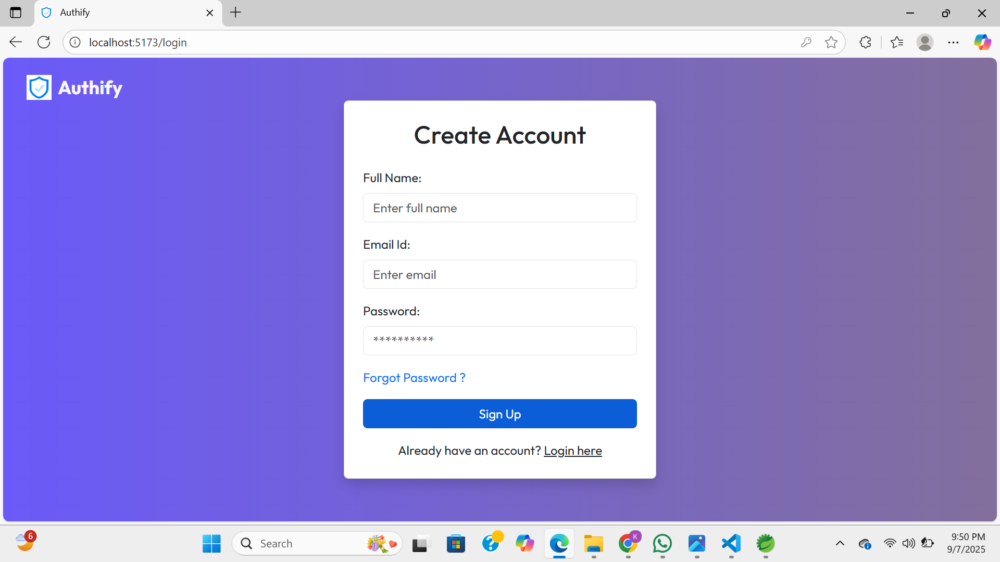

# 🚀 Authify - Full Stack Authentication System

Authify is a secure **full-stack authentication system** built with **ReactJS** (frontend) and **Spring Boot** (backend).  
It provides user authentication and authorization with JWT, email verification, and role-based access using Spring Security.  

---

## ✨ Features / Functionality
- 🔐 **User Registration & Login** – Signup and login forms with validation  
- 🔑 **JWT Authentication** – Secure session handling with JSON Web Tokens  
- 🔒 **Spring Security** – Role-based access control for users/admins  
- 📧 **Email Support** – Email verification & notifications with JavaMail  
- 🚫 **Protected Routes** – Certain pages accessible only to authenticated users  
- 📱 **Responsive UI** – Styled with Bootstrap 5  
- 💾 **Database Integration** – User data stored securely in MySQL  

---

## 🧑‍💻 Tech Stack Used
- **Spring Boot** – Backend framework  
- **Spring Security** – Authentication & authorization  
- **JavaMail** – Email verification & communication  
- **JWT (JSON Web Tokens)** – Token-based authentication  
- **ReactJS** – Frontend UI  
- **Bootstrap 5** – Styling and responsive design  
- **MySQL** – Relational database  

---

## 📸 Screenshots

### Dashboard (Protected)  


### Login Page  


### SignUp Page  


---

## ⚙️ Installation & Setup

### 1️⃣ Clone the Repository
```bash
git clone https://github.com/kashish-0019/Authify---Full-Stack-Authentication-System.git


